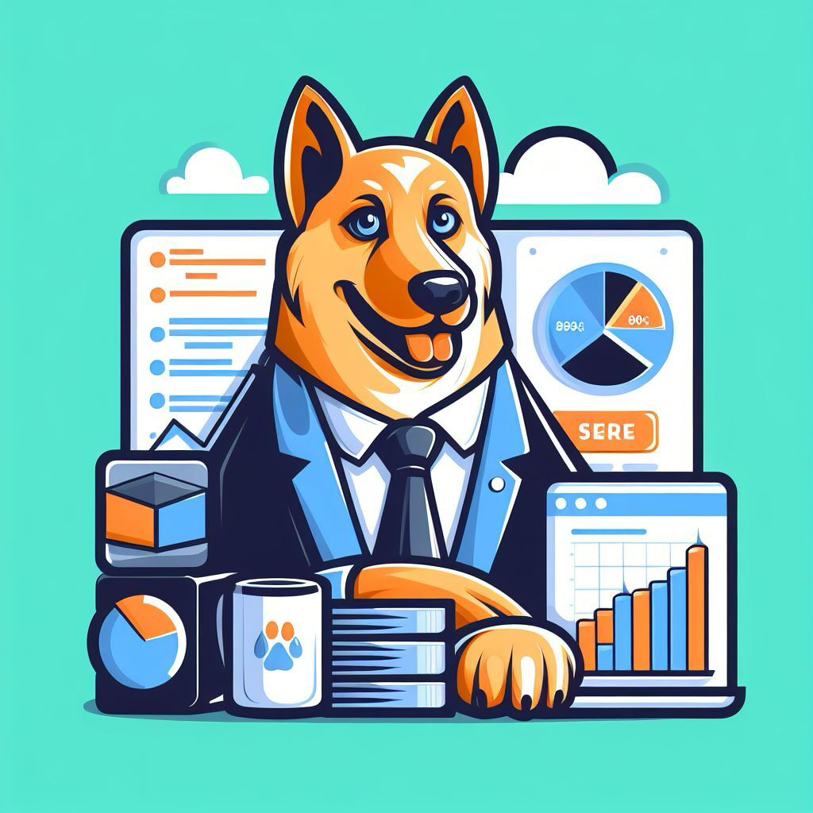
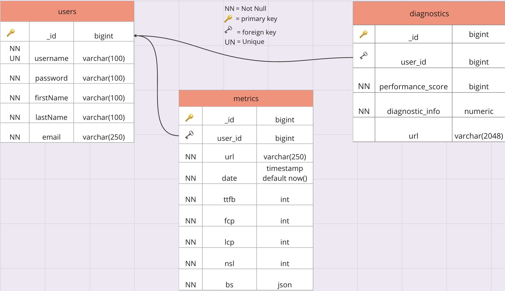
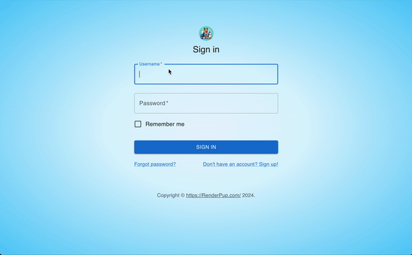
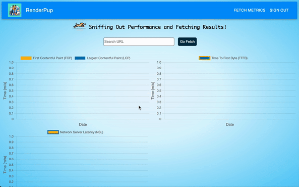
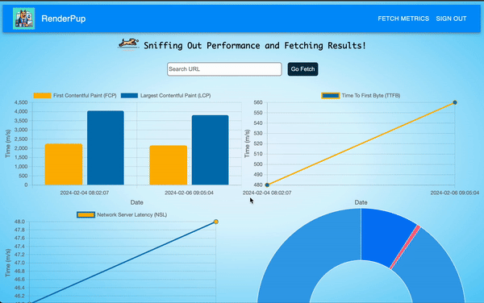

# RenderPup

<div align='center'>
  
</div>

<div align='center'>

[](https://www.javascript.com/)
[](https://react.dev/)
[](https://reactrouter.com/en/main)
[](https://nodejs.org/en)


[](https://www.postgresql.org/)
[](https://mui.com/)
[](https://www.chartjs.org/)


[](https://jestjs.io/)
[](https://webpack.js.org/)
[](https://miro.com/)
[](https://github.com/)
</div>

RenderPup is a web application designed to analyze Next.js websites by running various performance tests and providing insightful metrics. With RenderPup, users can input a URL for a Next.js website, and the application will conduct tests to measure important performance metrics such as time to first byte, first and largest contentful paint, network server latency, and bundle size.

## Description

RenderPup addresses the critical need for developers and website owners to understand the performance characteristics of their Next.js websites. By providing comprehensive metrics, RenderPup enables users to identify potential bottlenecks and optimize their websites for better user experience and search engine rankings.

### Key Features

- **Performance Testing**: RenderPup conducts various tests to assess the performance of Next.js websites.
- **Real-Time Metric Analysis**: It provides detailed metrics including time to first byte, first and largest contentful paint, network server latency, and bundle size.
- **User-friendly Interface**: RenderPup features a simple and intuitive interface, making it easy for users to input URLs and view performance metrics.
- **Dashboard**: A user-friendly dashboard to visualize performance metrics and gain actionable insights.

## How to Use

Prerequisites

1.  Fork this repo and clone using the following command:
```sh
git clone https://github.com/oslabs-beta/RenderPup.git
```
2.  In the root folder, install all the dependencies needed for the application using the following command:
```sh
npm i
```
3.  Add postgreSQL connection string to PG_URI in .env file
```sh
PG_URI = <Your URI string>
```
4.  Add .env to .gitignore file for security before committing and pushing to github

5.  Run the following command to ensure all dependancy updates are reflected:
```sh
npm run build
```
6.  Run the application in the root folder using the following command:
```sh
npm start
```

## Setting up PostgreSQL Database 

1.  Create a 'Users' table with columns '_id', 'username', 'password', 'firstName', 'lastName' and 'email'.
 - '_id' will act as the primary key for the 'Users' table
2.  Create a 'Metrics' table with columns '_id', 'user_id', 'url', 'date', 'ttfb', 'fcp', 'lcp', 'nsl', and 'bs'
- '_id' will act as the primary key for the 'Metrics' table
- 'user_id' will act as the foreign key to the 'Users' table 
3.  Create a 'Diagnostics' table with columns '_id', 'user_id', 'performance_score', 'diagnostics_info', and 'url'
-  '_id' will act as the primary key
-  'user_id' will act as the foreign key to the 'Users' table

<p align="center">
  
</p>

## Running The Application

1.  Create a new user by clicking on the "Don't have an account? Sign up!" button near the bottom right of the "Sign In" button:

<p align="center">
    
</p>

2.  Once signed up, use the login in credentials you just created to log in to your dashboard:

<p align="center">
    
</p>

3.  To begin searching performance metrics, input a web application url in the empty text input bar, followed by pressing the "Go Fetch" button directly to the right:

<p align="center">
    
</p>

4.  View any web application url performance metrics previously searched by clicking the "Fetch Metrics" button in the top right corner inside of the navigation bar:

<p align="center">
    
</p>

-  To view updated performance metrics charts/data, navigate to the intended url in your "Fetch Metrics" tab, followed by an additional run on said url in the input bar.  This will show the most recent metrics in combination with previous runs on said url for comparison.

-  You may also hover over any graph data to view the singular metric data point.

5.  Once you have completed your work with the application, you may sign out using the "Sign Out" button in the top right corner on the navbar.  This will sign you out and lead you back to the log in page.

<p align="center">
    
</p>

## How to Contribute

We welcome contributions to the RenderPup repository! To contribute, follow these steps:

1. Fork the RenderPup repository to your GitHub account.
2. Clone the forked repository to your local machine (make sure to change where it says your-github-username to your username):
```bash
git clone https://github.com/your-github-username/oslabs-beta/RenderPup.git
```
3. Create a new branch for your feature or bug fix:
```bash
git checkout -b feature-name
```
4. Make your changes and commit them with descriptive commit messages:
```bash
git commit -m "Description of changes"
```
5. Push your changes to your forked repository:
```bash
git push origin feature-name
```
6. Create a pull request from your forked repository to the main RenderPup repository.
7. Our team will review your pull request and merge it if it aligns with the project's goals.

Thank you for contributing to RenderPup! Your contributions help improve the performance analysis capabilities of Next.js websites.

## Iteration Opportunities

| Feature                                                                               | Status    |
|---------------------------------------------------------------------------------------|-----------|
| Create component for rendering performance score and opportunities provided through lighthouse report on a per fetched url basis                                               | ✅        |
| Add additional metric data gathered through lighthouse with ability for user to select which metrics to collect and view      | ⏳        |
| Convert time stamp to display local time zone of user                                                                       | ⏳        |
| Add a landing page for app                                                                         | 🙏🏻        |
| Add functionality for O-Auth for accessible user creation and login                                                         | 🙏🏻        |
| Convert to desktop based application                                           | 🙏🏻        |
| 

- ✅ = Ready to use
- ⏳ = In progress
- 🙏🏻 = Looking for contributors

## Our Team
<div align='center'>
  <table>
    <tr>
      <td align='center'>
        
        <br />
        <b>Tanner Robertson<b>
        <br />
          <a href='https://github.com/XilloGen'>🐙 GitHub</a>
          <br>
          <a href='https://www.linkedin.com/in/tanner-robertson-3343a42a2/'>🖇️ LinkedIn</a>
      </td>
      <td align='center'>
        
        <br />
        <b>Ariel Maor<b>
        <br />
        <a href='https://github.com/Amaor426'>🐙 GitHub</a>
        <br>
        <a href='https://www.linkedin.com/in/ariel-maor-aa419220/'>🖇️ LinkedIn</a>
      </td>
      <td align='center'>
        
        <br />
        <b>Charmie Dubongco<b>
        <br />
        <a href='https://github.com/charmieduhh'>🐙 GitHub</a>
        <br>
        <a href='https://www.linkedin.com/in/charmie-d-17293011b/'>🖇️ LinkedIn</a>
      </td>
      <td align='center'>
        
        <br />
        <b>Vicky Hoang<b>
        <br />
        <a href='https://github.com/vkhoang'>🐙 GitHub</a>
        <br>
        <a href='https://www.linkedin.com/in/vkhoang/'>🖇️ LinkedIn</a>
      </td>
    </tr>
  </table>
</div>
